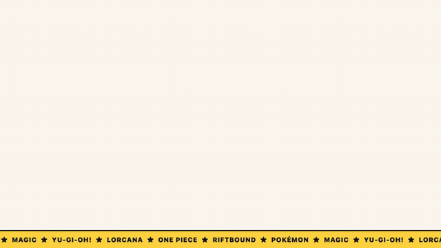

<p align="center">
  <picture>
    <source media="(prefers-color-scheme: dark)" srcset="assets/rarebox-intro-dark.gif">
    
  </picture>
</p>

# Rarebox

Track your TCG collection across Pokémon, Magic: The Gathering, Disney Lorcana, One Piece Card Game, Yu-Gi-Oh!, and Riftbound — cards, sealed products, and graded slabs — with live prices, shelf value charts, and a trade analyzer.

As of v1.4.0 the entire app wears **Tactile** — a custom design system (cream paper, ink lines, hard shadows that compress when pressed) with a bottom tab bar on phones/foldables/tablets and a top bar on desktop. Five alternative design prototypes remain live at [/designs](https://rarebox.io/designs).

**Live at [rarebox.io](https://rarebox.io)** · **Docs at [docs.rarebox.io](https://docs.rarebox.io)**

Built by [Nova](https://github.com/novaoc).

## Design — Tactile

- Custom design system in `src/assets/main.css`: semantic tokens (cream `#faf6ef`, ink `#141414`, four accent fills), 2px ink borders, hard offset shadows with press-compression on every button
- Navigation: bottom tab bar (Home · Search · Trade · Browse · More) under 1024px with safe-area support and a raised Trade disc; slim top bar with inline nav on desktop — the sidebar is retired
- "RB" sticker logomark across top bar, favicon, and PWA icon
- Marketing landing page with a rotating cross-TCG card showcase — 14 iconic cards across all six games (Lugia 1st Ed, Manga Luffy, Blue-Eyes, Riftbound Signatures, Traveling Chocobo, The Soul Stone…), prices seeded from Rarebox's own feeds and re-fetched live on every view; the "shelf" total is computed from the cards actually displayed
- Tactile is rationed for daily use: stickers/rotations only on moments (total value, trade verdict, empty states)
- Design Lab: five complete brand directions (Mono, Aurora, Tactile, Atelier, Pulse) at `/designs`, each verified at 280px (foldable cover), 360px, 717px (unfolded foldable), 834px and 1280px+

## Features

### Collection Management
- Add cards by searching any set — live results with card images and prices from each TCG's API
- Common search bar with TCG filter pills — search all 6 games simultaneously
- Add sealed products (booster boxes, ETBs, tins, packs) — prices and images from PriceCharting
- Add graded slabs (PSA / BGS / CGC / ACE) — grade-specific pricing and multipliers, available for all TCGs
- Bulk import — paste a PTCGL/PTCGO deck list and add all cards at once
- Multiple named shelves, each with a color and their own value chart
- Combined dashboard showing total collection value, cost basis, and gain/loss across all shelves
- Add an entire set to a portfolio in one click from any Browse Sets view

### Browse Sets (Multi-TCG)
- Landing page with branded tiles for each TCG — tap to explore
- **Pokémon** — full dedicated experience with English and Japanese sets, variant logos, card images, and TCGPlayer prices
- **Magic: The Gathering** — every English set via Scryfall, USD prices, set symbol icons
- **Disney Lorcana** — all sets via Lorcast, USD prices, branded set badges
- **One Piece Card Game** — 20 English sets, 3300+ cards via optcgapi, USD market prices
- **Yu-Gi-Oh!** — all sets via YGOPRODeck, TCGPlayer market prices
- **Riftbound (League of Legends TCG)** — 7 sets, 1000+ cards via riftcodex.com, card images from Riot CDN, TCGplayer market prices joined on product id (full promo coverage; PriceCharting fallback)
- Click any set → full card grid with card images → "+ Add" opens the add modal pre-filled

### Card Database (Client-Side Index)
- On first visit, selects which TCGs to track
- Preloads all card data into IndexedDB in the background — 0 API calls on subsequent searches
- Floating progress pill shows per-game status, ETA, and overall completion
- Interrupted preloads resume silently on refresh
- Search works immediately — uncached TCGs fall back to live APIs

### Search
- Unified search across all 6 TCGs — one input, live results, filter by game
- Cached TCGs searched instantly from local IndexedDB
- Uncached TCGs searched via live API with automatic fan-out and result merging
- Results sorted by relevance: exact name → prefix → alphabetical
- Token-based matching — every word must appear, so "ahri inquisitive" finds "Ahri - Inquisitive" across punctuation
- Sealed product search via PriceCharting — keyword-filtered for boosters, ETBs, tins, etc.

### Price Alerts
- Set "notify when price goes above/below $X" on any card
- Alerts fire via the browser Notification API when prices cross thresholds
- Manage active and triggered alerts from Settings
- All alerts stored locally — no server

### Deck Builder
- Create multiple named decks per TCG, add cards by search
- Track deck cost, ownership status (Need / Owned / ✓ Owned)
- Compare deck cards against your collection — shows which cards you already own
- Import current meta decks with one click — supports all 6 TCGs
- Refresh prices on any deck with one tap

### Live Meta Decks
- Auto-fetches current tournament meta from each TCG's competitive scene:
  - **Pokémon** — Limitless TCG
  - **Magic** — mtgtop8.com
  - **Lorcana** — inkdecks.com
  - **One Piece** — optcg.one
  - **Riftbound** — RiftDecks.com
  - **Yu-Gi-Oh!** — ygoprodeck.com
- Shows top 10 competitive decks ranked by meta share
- Cards resolved server-side with exact card match (set code + number)
- Market prices from TCGPlayer / PriceCharting for every card
- Cached for 24h with version-based invalidation — instant on repeat visits

### Card Booth (IRL selling)
- Set up a booth for a card show or store table: pick items from your shelves, put your asking price on them — or **search the card database** to list things you haven't tracked
- **Sealed products are first-class listings**: search booster boxes, ETBs, decks, and tins across all six games (plus Japanese Pokémon) from a daily-built TCGplayer index of 8,500+ sealed products — canonical product ids, so the same box always matches no matter what anyone calls it
- **ISO wantlist**: keep a list of the cards & sealed you're hunting (add by search, or one tap turns a master set's missing cards into wants). Scan any booth QR and matches light up instantly — **including stock that's in a binder under the table** — with a "show matches only" toggle, per-shop 🎯 badges on saved shops, and qty / max-price per want
- **Table mode** (`Booth → 🔥 Table`): a one-thumb live-inventory screen for mid-show chaos — filter-as-you-type, big **💵 Sold / 🔁 Trade** buttons (quantity decrements, undo reverses whole deals), and a full **table ledger**: trades record what came in (search it, set the agreed value, list it on the table in the same motion) plus cash on top in either direction; a buy mode logs mid-show pickups and deducts what you paid from table cash (net can go negative — that's dealering); recap chips show net cash, trades, and buys live
- **📊 Excel export per booth**: Summary (all-time + today earnings, trades in/out, net cash), Ledger (every movement with timestamps and trade grouping), and current Listings — your whole show in one workbook
- **📡 Remote display**: leave a tablet at the table showing the booth QR and run everything from your phone — sales re-encode the tablet's code within seconds. Devices pair via one QR; updates travel **end-to-end encrypted** through ntfy.sh (the relay only ever sees scrambled bytes; the key never leaves the pairing code)
- **Live kiosk QR**: table mode can show a full-screen QR that **re-encodes itself every time your inventory changes** (screen stays awake) — prop a phone on a stand and every scan is current. Shares also carry a timestamp, so buyers see "snapshot 2h ago" and get a re-scan nudge on stale links
- **Booth branding**: accent color + emoji/initials monogram (a few bytes in the share, works offline) with an optional hosted logo — buyers see your colors, and the QR poster paints in them too
- Booth details with almost no typing: store/event name, table #, and a **location picker** (search the venue via OpenStreetMap or one-tap GPS) — buyers get a **Get directions** button that opens their maps app
- Share as a link or QR — the **entire booth travels inside the link** (URL fragment), so nothing is uploaded or hosted anywhere
- Small booths: one QR scannable by any phone camera; big booths: animated multi-frame QR (scanned from Booth → Scan); 250-listing cap keeps every share path comfortable
- Buyers see a read-only booth with your prices and a table total, and can **save shops** to revisit later — even offline
- **Compare to market**: any saved shop's asking prices checked against live Rarebox-tracked prices — per-item over/under deltas and a verdict badge ("12% under market")
- Saved shops sort by total or name, and a **cross-shop search** finds a card across every booth you've saved — with game and max-price filters ("everything under $20 at every table" needs no search text). Built for big events
- **Booth directories**: bundle saved shops into one QR/link (entries are tiny da.gd short links — a 40-booth hall fits a single camera-scannable QR); recipients tap "Add all" and every booth downloads to their device with a progress bar. Perfect for event organizers
- In-app tutorial video on the Booth page (auto-plays once, replay via the ⓘ icon)
- Visitor-friendly by design: shared booths show no database prompts or download popups — first-timers get a small dismissible invite to try Rarebox instead
- Uniform listing mats: card scans, booster boxes, and tins all frame to the same size
- Booths, saved shops, the wantlist, and the day journal are included in backups and device transfer

### Trade Analyzer
- Side-by-side trade comparison — add cards to Side A and Side B via search or camera scan
- Live price delta with winning/losing/even label
- Grading multiplier applied per card (PSA 10 = 2x, etc.)
- Persistent trade state across sessions (IndexedDB)
- Camera scan identifies cards by **perceptual-hash image matching** (pHash + dHash against a precomputed index of 30,000+ reference card images — the technique used by industrial card sorters), giving the exact printing in under a second with no text reading
- Photos are perspective-rectified before matching (Sobel → Hough → corner detection → homography warp, pure on-device JS) — thresholds calibrated on a synthetic photo harness so the scanner **never suggests a wrong card**: uncertain scans fall back to search instead of guessing
- Hash indexes ship as static files (~840KB total for Pokémon EN/JP, Riftbound, Lorcana, One Piece); regenerate with `python3 scripts/build_scan_index.py <game>`
- OCR (Tesseract.js v7, English + Japanese) remains as the fallback for unindexed games and low-confidence matches; failed scans pre-fill the search box with the recognized text

### Pricing & Charts
- Live card prices from pokemontcg.io, Scryfall, Lorcast, optcgapi, YGOPRODeck, riftcodex.com, and PriceCharting
- Per-type price staleness tracking — cards refreshed every 24h, sealed/graded every 12h
- Price history charts (7D / 1M / 6M / 1Y / 3Y ranges) from multiple historical data sources
- Shelf value-over-time chart with daily price snapshots (3 years retained)
- Graded-grade multipliers for price estimation

### Export, Import & Backup
- Export individual shelves to Excel (.xlsx) with summary + items sheets
- Export all shelves to a single Excel file
- Backup entire collection as JSON — download and restore on any device
- **Collectr import** — import CSV or Excel exports from the Collectr app (maps game names, variants, grading, sealed products)
- **Transfer to device** — gzip-compressed QR code or clipboard copy/paste for moving collections between devices
- Stale data cleanup — deleted cards don't linger in snapshots or backups
- Storage usage display in Settings — shows combined IndexedDB + localStorage usage via `navigator.storage.estimate()`
- **Reset Everything** — clears all shelves, card cache, and stored data with a single button

### Mobile
- Bottom tab bar navigation with 44px+ touch targets and iOS safe-area support
- Touch-friendly card grids with persistent overlay buttons on touch devices
- Bottom sheet panels for card details, search results, and portfolio items
- Responsive charts, stacked headers, column hiding on smaller screens
- Layouts verified down to 280px (foldable cover screens) and across tablet/foldable widths

### PWA & Offline — works like a binder
- Installable as a standalone app on Android and iOS
- Auto-detects platform and shows relevant install prompt
- **Fully offline after the first visit** — a service worker precaches the
  entire app shell, so the app opens and every section works with zero
  signal; your collection was always on-device (IndexedDB)
- Card images cache as you view them; tour videos and scan indexes cache
  on first use
- Live prices and new card searches stay live (never served stale) — an
  offline chip tells you when those need a connection
- **Browse works offline** — set lists and card pages persist on-device
  after one online visit (stale beats blank when the network is gone)
- Deploys still land instantly: navigations are network-first, the cache
  is only a fallback

### SEO
- Clean URLs, per-route page titles, dynamic OG tags
- Sitemap and robots.txt for search engine indexing

### Data & Privacy
- All data stored locally in your browser (IndexedDB via Dexie.js)
- No accounts, no server — everything runs client-side
- Automatic migration from localStorage for existing users
- Debounced writes with crash-safe flush (beforeunload)
- Price data fetched directly from public APIs in the browser
- Per-type price staleness tracking — cards (24h), sealed/graded (12h)
- Terms & Conditions page with full Privacy Policy at [/terms](https://rarebox.io/terms)
- **Zero analytics** — no page-view counting, no trackers, no cookies of any kind; your collection never leaves the device unless you export it

### Feature Tour Videos
- In-app tutorial videos for Browse Sets, Decks, and Trade Analyzer — Tactile-branded motion graphics with real cards and live-style prices, in light and dark variants matched to your theme
- Auto-play once on first visit
- Replay anytime via ⓘ info icon next to the page title
- Authored as a Tactile animation stage (scripts/tour-stage.html) and recorded headless — regenerate with scripts/record-tours (Playwright + ffmpeg)

## Performance

- Card database preloaded into IndexedDB — instant search with zero API calls for cached TCGs
- Pokémon card data loads in ~10 seconds via the official bulk dataset on jsDelivr (20,000+ cards); prices stream in via a background pass with incremental saves and automatic resume
- Set data cached in localStorage for 24h — instant load on return visits
- Multi-TCG API responses cached in memory (1h sets, 10min cards)
- pokemontcg.io responses trimmed with `select=` — 50-60% smaller payloads
- DNS prefetch for all external domains (APIs and CDNs)
- Chart rebuilds debounced (300ms), 404s cached as misses
- Daily price snapshots use cached prices only — zero API calls
- API calls batched — max 3-5 concurrent requests (no burst scraping)
- Retry with backoff on transient errors (429, 5xx, timeout) — 2 retries, 1s/2s delays
- 8s timeout on all external fetches (no hanging requests)
- Abort-on-unmount for in-flight API calls (no stale state updates)
- Two-phase preloader: sets first (~2s), then cards progressively per TCG
- Failed TCGs get 2 retries with exponential backoff

## Stack

- Vue 3 + Vite
- Pinia (state management)
- Dexie.js (IndexedDB persistence)
- ApexCharts (price/portfolio charts)
- Vue Router (navigation)
- XLSX (Excel export)
- Tesseract.js (OCR for camera scan)
- pokemontcg.io API (Pokémon card data + live prices)
- tcgdex API (Japanese sets/cards, price history Nov 2022+)
- Scryfall API (Magic sets/cards/prices, set symbol icons)
- Lorcast API (Lorcana sets/cards/prices)
- optcgapi API (One Piece sets/cards/market prices)
- YGOPRODeck API (Yu-Gi-Oh! sets/cards/prices)
- riftcodex.com API (Riftbound sets/cards/images)
- PriceCharting JSON API (sealed + graded prices for all TCGs; Riftbound singles fallback)
- tcgcsv.com TCGplayer dumps (Riftbound + Japanese Pokémon prices, via daily CI — see below)
- Pokellector CDN (Japanese set logos)
- Vercel (static hosting; the only serverless function left is `/api/og` for social-embed images)

## Multi-TCG Browse (architecture)

"Browse Sets" is a hub for multiple trading card games.

**Flow & routes**
- `/sets` → `BrowseView.vue` — landing page with branded tiles per TCG.
- `/sets/pokemon` → `SetsView.vue` — the full Pokémon experience (JP, variants, charts). **Untouched** — keep it separate.
- `/sets/:game` → `TcgSetsView.vue` — generic sets grid → cards grid (card images, live prices). Card "+ Add" opens `AddItemModal` via its `tcgCard` prop (pre-filled, game-tagged).

**Search** — `src/services/tcg/multiSearch.js`
Fans out to all TCG APIs in parallel, normalizes results to a common shape, sorts by name relevance, and paginates. When a TCG's data is cached in IndexedDB, searches that TCG locally instead of hitting the live API.

**Data layer** — `src/services/tcg/providers.js`
Each game is normalized to a uniform interface:
```
getSets()        -> [{ id, name, code, releaseDate, total, logo }]
getSetCards(id)  -> [{ id, name, number, image, price, rarity }]
```
`TCGS` (same file) drives the landing tiles with inline SVG brand logos.

**Status**

| TCG | Source | Status |
|-----|--------|--------|
| Pokémon | pokemontcg.io / tcgdex | ✅ dedicated `SetsView` with JP support |
| Magic | Scryfall (CORS `*`) | ✅ sets, cards, USD prices, set symbol icons |
| Lorcana | Lorcast (CORS `*`) | ✅ sets, cards, USD prices |
| One Piece | optcgapi (CORS allowed) | ✅ 20 sets, 3300+ cards, USD market prices |
| Yu-Gi-Oh! | YGOPRODeck (CORS `*`) | ✅ all sets, 13000+ cards, TCGPlayer prices |
| Riftbound | riftcodex.com (CORS `*`) | ✅ 7 sets, 1000+ cards, images from Riot CDN, TCGplayer prices (static asset; PriceCharting fallback) |

**To add a TCG:** add a provider object (`getSets`/`getSetCards`) to
`providers.js`, register it in `PROVIDERS`, and add a `TCGS` entry with
`available:true` + `route:'/sets/<id>'`. Optionally add a preloader in
`cardPreloader.js`, an API endpoint in `multiSearch.js`, and a resolver in
`resolveCard()`. No view changes needed.

## Static data assets (daily CI refresh)

The app is local-only: Vercel serves only code and static assets, and your
device makes every API call itself — no serverless data endpoints. Sources
that can't be called from a browser (tcgcsv.com has no CORS and is
backend-scripts-only by policy; meta-deck sites need scraping) are instead
pre-built into static JSON by `.github/workflows/refresh-data.yml`, which runs
daily at 21:00 UTC (23:00 retry) and commits only when the data changed:

| Asset | Built by | Contents |
|-------|----------|----------|
| `public/riftbound-prices.json` | `scripts/build_riftbound_prices.py` | TCGplayer market prices for all Riftbound cards, keyed by product id |
| `public/jp-prices.json` | `scripts/build_jp_prices.py` | TCGplayer prices for 16k+ Japanese Pokémon cards, keyed `set-number` |
| `public/meta-decks/*.json` | `scripts/build_meta_decks.py` | Scraped meta decks per game (scrapers keep yesterday's file on failure) |

Each commit triggers the normal Vercel static deploy, so the app just fetches
these as same-origin assets (works in plain `vite dev` too).

**Forks:** the workflow job is gated on `github.repository == 'novaoc/rarebox'`
so forks don't hit tcgcsv with Rarebox-attributed traffic. A fork still works
without it — the committed JSON ships with the clone, just frozen at fork
time. To self-refresh: edit the guard in `refresh-data.yml`, change the
`User-Agent` in `scripts/build_*_prices.py` to identify *your* deployment
(tcgcsv requires an identifying UA — generic browser UAs get 401), and enable
the workflow in your fork's Actions tab (GitHub disables inherited crons by
default).

## Releases

- **[v1.4.3](https://github.com/novaoc/rarebox/releases/tag/v1.4.3)** — **The booth release.** New Card Booth feature: set up your table for a card show, list items from your shelves with your asking prices, and share as a link or QR — the entire booth travels inside the link (URL fragment), zero servers, true to the privacy stance. Buyers browse read-only with a table total and can save shops to revisit offline; an in-app scanner reads both single and animated QR codes. **Transfer rebuilt:** animated multi-frame QR (no more "too large"), camera scanning in Receive, and a fix for imports being silently discarded since the IndexedDB migration; backups now carry decks + trade data. **Polish:** shared booths are popup-free with a dismissible invite for newcomers, uniform listing mats for any image shape.
- **[v1.4.2](https://github.com/novaoc/rarebox/releases/tag/v1.4.2)** — **The offline release.** Rarebox now works like a binder: a build-time-generated service worker precaches the app shell, so once you've visited, the whole app opens and navigates with zero connection — shelf, decks, search, everything (your data always lived on-device). Card images cache as you view them; live prices and new searches are never served stale, and an offline chip says so when they need a connection. **Tours:** rebuilt trigger system — tours now actually auto-play on first visit, the sets tour moved to the Browse hub with one card per game, and the replay ⓘ finally shows on desktop. **Privacy:** Vercel analytics removed entirely — zero data collection, stated plainly in the refreshed Terms & Privacy. **Brand:** X/Twitter launch assets (avatar + light/dark banners) rendered from Tactile tokens.
- **[v1.4.1](https://github.com/novaoc/rarebox/releases/tag/v1.4.1)** — **The scanner release.** Card scanning rebuilt on perceptual-hash image matching (research-driven: the technique used by industrial card sorters) with on-device perspective rectification — exact printing identified in ~1 second, zero wrong identifications on the calibration harness, OCR demoted to fallback. 30k-card hash indexes ship as ~840KB of static files. **Link previews:** dynamic Tactile OG banner at /api/og with daily-rotating showcase cards and live prices for Discord/Telegram/WhatsApp/X; marketing copy for text-only embeds. **PWA:** proper home-screen icons (iOS finally gets a real touch icon), top bar clears the phone status bar in installed mode. **Landing:** rotating cross-TCG showcase with live-tracked prices summed into the shelf total, full-bleed marquee, import CTA. **Fixes:** pull-to-refresh no longer hijacks scrolling after you scroll down (page-stuck bug), trade analyzer stacks on foldables in landscape, date inputs contained on iOS, "hide loading progress" setting actually honored, Reset Everything wipes trade analyzer + decks, sitemap pointed at the wrong domain (!), Terms & Privacy refreshed for all current APIs and features, anonymous cookieless Vercel Web Analytics.
- **[v1.4.0](https://github.com/novaoc/rarebox/releases/tag/v1.4.0)** — **The Tactile release.** Complete app redesign: Tactile design system (cream/ink, hard shadows), bottom tab bar navigation on mobile/foldables, RB sticker branding, new marketing landing with a rotating live-priced cross-TCG showcase, and a Design Lab with five brand prototypes at /designs. **Speed:** Pokémon card DB loads in ~10s via bulk data (was 10-45 min); background price pass with incremental saves + auto-resume. **Search:** token-based multi-word matching everywhere; priceless-cache fallthrough to live APIs; trade search shows 30 results. **Scanner rebuilt:** tesseract.js v7, Japanese card support via tcgdex, name/number band passes, failed scans pre-fill the search box. **Fixes:** JP card images (tcgdex URLs + corrected set-name table), Collectr import resolution (multi-set candidates, set aliases, validated numbers), restored portfolio price refresh (Riftbound/MTG/One Piece prices on mobile), variant-correct Riftbound prices (Signatures no longer show plain prices), Yu-Gi-Oh per-printing prices, duplicate portfolio rows on desktop, deck builder images, Settings refresh button (was a silent no-op), Reset Everything now wipes trade analyzer + decks, image error fallbacks across all views.
- **[v1.3.0](https://github.com/novaoc/rarebox/releases/tag/v1.3.0)** — Yu-Gi-Oh! support (sets, cards, search, meta decks). Trade Analyzer (side-by-side comparison, camera scan). Collectr import (CSV/XLSX). Card database preloader with progress indicator. Price alerts with browser notifications. Entire set add to portfolio. Sealed product search improvements. Graded card multipliers. Storage usage display. Reset clears card cache. Navigation and transition fixes. **Critical bug fixes:** trade/portfolio state persistence conflict resolved (separate IDB keys), price alerts now auto-checked on dashboard, non-Pokemon cards refresh prices on dashboard load, Collectr import resolves all 6 TCGs. **Lorcana fixes:** meta deck cards load correctly (set field paths, version-aware name matching). **Riftbound fixes:** meta deck cards show correct images/sets/prices. 404 catch-all route. Dynamic imports hoisted per PR review.
- **[v1.2.0](https://github.com/novaoc/rarebox/releases/tag/v1.2.0)** — Riftbound TCG via riftcodex.com (7 sets, 1000+ cards, card images). Sealed products for all TCGs. Graded cards for all TCGs. Type filtering fix.
- **[v1.1.0](https://github.com/novaoc/rarebox/releases/tag/v1.1.0)** — Multi-TCG Browse & Search: Magic (Scryfall), Lorcana (Lorcast), One Piece (optcgapi) with live prices. Unified search across all TCGs. Graded cards for all TCGs. Brand logos. API caching + abort-on-unmount.
- **[v1.0.1](https://github.com/novaoc/rarebox/releases/tag/v1.0.1)** — Critical fix: Vue reactive proxies couldn't be serialized to IndexedDB
- **[v1.0.0](https://github.com/novaoc/rarebox/releases/tag/v1.0.0)** — First release. Full feature set: collections, decks, meta decks, pricing, charts, PWA, SEO, bulk import, backup/transfer, IndexedDB persistence

## Getting Started

```bash
npm install
npm run dev
```

Opens at http://localhost:5173

## Build

```bash
npm run build
```

## License

MIT
